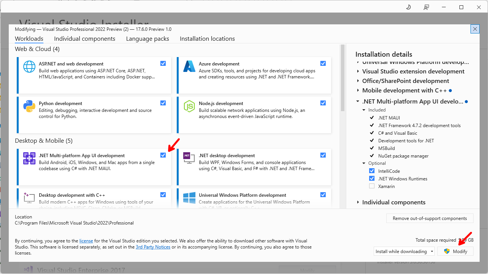
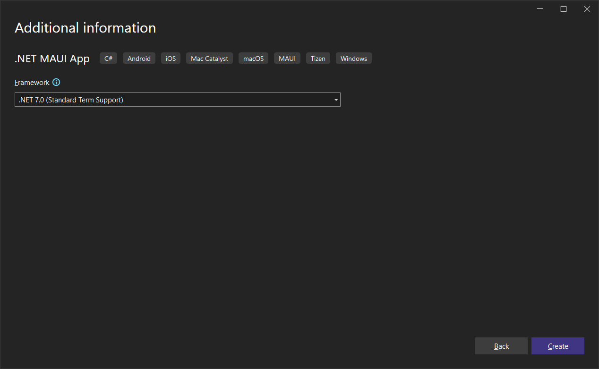

# Bindable Properties Validation in MAUI

Bindable properties are an essential part of developing a robust user interface in MAUI. They allow you to create properties that can be bound to UI elements, enabling you to respond to user input and update the UI in real-time. With bindable properties, you can also perform validation on user input and display errors in the UI.

## Introduction

In this tutorial, we'll build upon our previous demo and explore the AvnObservable library. Using AvnObservable, we can easily extend the functionality of `ObservableCollection` to create `ObservableCollectionWithSelection`, which enables us to notify the binding system when a selected item in a collection changes.

Next, we'll delve into BindableProperty validation and error handling, which allow us to specify validation rules for a BindableProperty instance and handle any errors that may occur. By incorporating these features into our app, we can ensure that our data is validated and displayed correctly, providing a more robust and user-friendly experience.

Here is a preview of what the final application will look like:

  

Let's dive in!

## Prerequisites

Before starting this tutorial, you should have some experience with C# and MAUI development. You should be familiar with creating and using controls and layouts in MAUI. If you're new to MAUI development, the [Official MAUI documentation](https://docs.microsoft.com/dotnet/maui/) is a great place to start. Additionally, if you have experience with Xamarin.Forms, it will be helpful in understanding some of the concepts in this tutorial.

To follow along with the demo in this tutorial, you will need:

- .NET 7 SDK or later
- Visual Studio 2022
- Basic knowledge of C# and XAML

If you don't have experience with Xamarin.Forms, don't worry, as we will be covering everything you need to know about Bindable Properties in MAUI. If you have these prerequisites covered, let's move on to building our demo application.

### .NET 7.0

Download the latest version of the .NET 7.0 SDK [here](https://dotnet.microsoft.com/en-us/download).

### Visual Studio 2022

To follow along with this demo, I will be using the latest version of Visual Studio 2022. You can download it [here](https://visualstudio.microsoft.com).

### Required Workloads

To build .NET MAUI applications, you will also need the .NET Multi-platform App UI development workload. If you haven't already installed it, you can do so by following these steps:

1. Open Visual Studio Installer and select "Modify" on your installation.
2. In the "Workloads" tab, select the ".NET Multi-platform App UI development" workload.
3. Click "Modify" to start the installation process.

  

Once the installation is complete, you're ready to start building your .NET MAUI applications.

## Demo

In this demo, we will dive into how to implement validation for bindable properties in your MAUI application. We will demonstrate how to use `BindableProperty.Create` to create a bindable property with validation and how to handle any validation errors that may arise.

We will expose a list as an `ObservableCollection<T>` with a twist. 

> :point_up: The goal of this demo is to allow the developer to use vanilla model classes. In other words, the models will not have to implement INotifyPropertyChanged or inherit from a base class that provides property change notification.

#### Create a new Project

Create a new **.NET MAUI App** project called `BindablePropertiesInMaui`




#### Set window size and position

Replace *App.xaml.cs* with the following code to set the size and center the window (if running on Windows):

```c#
namespace BindablePropertiesInMaui;

public partial class App : Application
{
    public App()
    {
        InitializeComponent();
        MainPage = new AppShell();
    }

    protected override Window CreateWindow(IActivationState activationState)
    {
        var window = base.CreateWindow(activationState);
        window.Created += Window_Created;
        return window;
    }

    private async void Window_Created(object sender, EventArgs e)
    {
#if WINDOWS
        const int defaultWidth = 1280;
        const int defaultHeight = 720;

        var window = (Window)sender;
        window.Width = defaultWidth;
        window.Height = defaultHeight;
        window.X = -defaultWidth;
        window.Y = -defaultHeight;

        await window.Dispatcher.DispatchAsync(() => { });

        var displayInfo = DeviceDisplay.Current.MainDisplayInfo;
        window.X = (displayInfo.Width / displayInfo.Density - window.Width) / 2;
        window.Y = (displayInfo.Height / displayInfo.Density - window.Height) / 2;
#endif
    }
}
```

#### Create the Model

Add *Person.cs* to the project:

```c#
namespace BindablePropertiesInMaui;

public class Person
{
    public Person(int id, string firstName, string lastName, DateTime dateOfBirth)
    {
        Id = id;
        FirstName = firstName;
        LastName = lastName;
        DateOfBirth = dateOfBirth;
    }

    public int Id { get; set; }

    public string _firstName;
    public string FirstName
    {
        get => _firstName;
        set
        {
            // I exposed the setter so you can put a break point here
            // proving that property values change in this vanilla class.
            _firstName = value;
        }
    }

    public string LastName { get; set; }
    public DateTime DateOfBirth { get; set; }
}
```

#### ObservableCollection

To add a list of people and bind it to an `ObservableCollection`, we first need to add a reference to the **AvnObservable** NuGet package. This package provides a useful class called `ObservableCollectionWithSelection<T>`, which extends the standard `ObservableCollection` class to track when the selected item in a collection changes and notify the data binding systems of the event.

One of the main advantages of using this package is that it exposes a `SelectedItem` property of type `T`, which allows you to easily retrieve the currently selected item in the collection. Additionally, it provides a `UpdateSelectedItemInCollection()` method that you can call from your `ObservableCollectionWithSelection<T>` collection to update the selected item when the user interacts with your UI.

```powershell
install-package AvnObservable
```

Let's look at what `ObservableCollectionWithSelection<T>` does.

Note that it inherits `ObservableCollection<T>`:

```c#
public class ObservableCollectionWithSelection<T> : ObservableCollection<T> where T : class
```

That means you can use it anywhere in your code where you would normally use an `ObservableCollection<T>`. `ObservableCollection<T>` provides property change notification when the collection changes, or items in the collection change.

However, since the goal of this demo is to allow the consumer of our component to use plain models (with no base class), I have provided a `SelectedItem` property, and the logic for making sure the selected item updates in the collection when changes are made to it.

The `AvnObservable` repo contains four demo apps that use `ObservableCollectionWithSelection<T>`. One for Blazor, one for MAUI, one for WPF, and one for Windows Forms. None of the demos us Bindable Properties, however. We will do that here.

For more information on `AvnObservable` check out the repo at this [link](https://github.com/carlfranklin/AvnObservable).

#### Add a new Xaml Component

In our demo we will create a XAML component that includes bindable properties. We will connect data to the component in our MainPage. 

The component will display a list from a bindable `ObservableCollectionWithSelection<T>` property, and allow the user to edit the selected item.

Add a new `ContentView` file and name it *PersonListComponent.xaml*.

To create a new `ContentView` file for the `PersonListComponent`, follow these steps:

1. In the Solution Explorer, right-click on the project and select "Add" > "New Item".
2. In the "Add New Item" dialog, select ".NET MAUI" > ".NET MAUI ContentView (XAML)".
3. Name the new file "PersonListComponent.xaml" and click "Add".


Replace the contents of *PersonListComponent.xaml* with the following:

```xaml
<?xml version="1.0" encoding="utf-8" ?>
<ContentView xmlns="http://schemas.microsoft.com/dotnet/2021/maui"
             xmlns:x="http://schemas.microsoft.com/winfx/2009/xaml"
             x:Class="BindablePropertiesInMaui.PersonListComponent">
	<StackLayout Margin="20">
		<Label FontSize="Medium"
			   FontAttributes="Bold"
			   Text="People" />
		<ScrollView VerticalOptions="FillAndExpand">
			<CollectionView x:Name="MyCollectionView"
							SelectionMode="Single"
							SelectedItem="{Binding PersonCollection.SelectedItem}"
							ItemsSource="{Binding PersonCollection}">
				<CollectionView.ItemTemplate>
					<DataTemplate>
						<Grid Padding="10">
							<Grid.RowDefinitions>
								<RowDefinition Height="Auto" />
							</Grid.RowDefinitions>
							<Grid.ColumnDefinitions>
								<ColumnDefinition Width="Auto" />
								<ColumnDefinition Width="Auto" />
							</Grid.ColumnDefinitions>
							<Label Grid.Column="0"
								   Text="{Binding FirstName}" />
							<Label Grid.Column="1"
								   Text="{Binding LastName}"
								   Margin="4,0,0,0"
								   VerticalOptions="End" />
						</Grid>
					</DataTemplate>
				</CollectionView.ItemTemplate>
			</CollectionView>
		</ScrollView>
		<StackLayout>
			<Label Text="Person"
				   FontSize="Medium"
				   Margin="0,24,0,0" />
			<Entry Text="{Binding PersonCollection.SelectedItem.FirstName}"
				   TextChanged="PersonPropertyChanged"
				   Placeholder="First Name"
				   Margin="0,24,0,0" />
			<Entry Text="{Binding PersonCollection.SelectedItem.LastName}"
				   TextChanged="PersonPropertyChanged"
				   Placeholder="Last Name"
				   Margin="0,24,0,0" />
			<DatePicker Date="{Binding PersonCollection.SelectedItem.DateOfBirth}"
						Margin="0,24,0,0" />
		</StackLayout>
	</StackLayout>
</ContentView>
```

Replace the `PersonListComponent.xaml.cs` file:

```csharp
using AvnObservable;

namespace BindablePropertiesInMaui;

public partial class PersonListComponent : ContentView
{
    public PersonListComponent()
    {
        InitializeComponent();
    }

    private void PersonPropertyChanged(object sender, TextChangedEventArgs e)
    {
        // required for instant updates as you type
        PersonCollection.UpdateSelectedItemInCollection();
    }

    // Define a bindable property for the PersonCollection
    public static readonly BindableProperty PersonCollectionProperty =
        // Use the BindableProperty.Create method to create a new bindable property
        BindableProperty.Create(nameof(PersonCollection),
        typeof(ObservableCollectionWithSelection<Person>),
        typeof(PersonListComponent),
        new ObservableCollectionWithSelection<Person>());

    // Define a property that wraps the bindable property
    public ObservableCollectionWithSelection<Person> PersonCollection
    {
        get => (ObservableCollectionWithSelection<Person>)GetValue(PersonCollectionProperty);
        set => SetValue(PersonCollectionProperty, value);
    }
}
```

We are defining a property called `PersonCollection`, which will be backed by a `BindableProperty` called `PersonCollectionProperty`. 

This is how `BindableProperty` should be used, as a backing field to a property.

This bindable property will allow us to bind our `PersonListComponent` to the code-behind and update the UI in response to changes in the `PersonCollection`.

Replace the contents of *MainPage.xaml* with the following:

```xaml
<?xml version="1.0" encoding="utf-8" ?>
<ContentPage xmlns="http://schemas.microsoft.com/dotnet/2021/maui"
			 xmlns:x="http://schemas.microsoft.com/winfx/2009/xaml"
			 x:Class="BindablePropertiesInMaui.MainPage"
			 xmlns:local="clr-namespace:BindablePropertiesInMaui">
	<local:PersonListComponent x:Name="personList" />
</ContentPage>
```

Replace the contents of *MainPage.xaml.cs* with the following:

```csharp
namespace BindablePropertiesInMaui;

public partial class MainPage : ContentPage
{
    public MainPage()
    {
        InitializeComponent();
        BindingContext = personList;

        // Add data to the PersonList component
        personList.PersonCollection = new AvnObservable.ObservableCollectionWithSelection<Person>
        {
            new Person(1, "Carl", "Franklin", DateTime.Now),
            new Person(2, "Isadora", "Jarr", DateTime.Now),
            new Person(3, "Hugh", "Jass", DateTime.Now)
        };

        // Handle selected item changing and changed events
        personList.PersonCollection.SelectedItemChanging+= PersonCollection_SelectedItemChanging;
        personList.PersonCollection.SelectedItemChanged+= PersonCollection_SelectedItemChanged;
    }

    private void PersonCollection_SelectedItemChanged(object sender, Person e)
    {
        // A new person has been selected
    }

    private void PersonCollection_SelectedItemChanging(object sender, Person e)
    {
        // Update the existing Person here
    }

    public void Dispose()
    {
        // Unhook the event handlers
        personList.PersonCollection.SelectedItemChanging-= PersonCollection_SelectedItemChanging;
        personList.PersonCollection.SelectedItemChanged-= PersonCollection_SelectedItemChanged;
    }
}
```

After running the application, you will notice a list of three names. When you click on any of the names, the selected item is automatically bound to the data entry at the bottom of the screen. Also note that the first person is automatically selected first:

  

Additionally, please observe that modifying any of the fields will automatically update the underlying collection.

  

### Validation

Let's proceed to add validation to the application. Although the use case we'll implement is simple, it'll demonstrate how to add validation to bindable properties. Specifically, we'll display a validation message if the collection hasn't been initialized with any elements; otherwise, we'll display the collection elements.

We can add a simple validation check to our `BindableProperty` by utilizing one of its overloads, which accepts a validation function in the `validateValue` parameter. To implement this, we can open the *PersonListComponent.xaml.cs* file and add the `validateValue` parameter with the `IsCollectionValid` function. This function will check if the `PersonCollection` is empty and return a boolean value accordingly.

Additionally, we need to add a `ValidationErrorMessageProperty` bindable property, which will hold the validation error message to display in case the collection is empty.

Let's add the `ValidationErrorMessageProperty` property first, in the *PersonListComponent.xaml.cs* file.

```csharp
// Define a bindable property for the validation error message
public static readonly BindableProperty ValidationErrorMessageProperty =
    BindableProperty.Create(nameof(ValidationErrorMessage),
    typeof(string),
    typeof(PersonListComponent));

// Define a property that wraps the validation error message bindable property
public string ValidationErrorMessage
{
    get => (string)GetValue(ValidationErrorMessageProperty);
    set => SetValue(ValidationErrorMessageProperty, value);
}
```

Now add the `IsCollectionValid` function:

```csharp
// Validation function to check if the collection has at least one item
static bool IsCollectionValid(BindableObject view, object value)
{
    if (((ObservableCollectionWithSelection<Person>)value).Count < 1)
    {
        ((PersonListComponent)view).ValidationErrorMessage = "Collection should be initialized with at least one item.";
        return false;
    }

    return true;
}
```

Finally, add the `validateValue` attribute to the `PersonCollectionProperty` bindable property creation code:

```c#
    // Define a bindable property for the PersonCollection
    public static readonly BindableProperty PersonCollectionProperty =
        // Use the BindableProperty.Create method to create a new bindable property
        BindableProperty.Create(nameof(PersonCollection),
        typeof(ObservableCollectionWithSelection<Person>),
        typeof(PersonListComponent),
        new ObservableCollectionWithSelection<Person>(),
        validateValue: IsCollectionValid);
```

The complete file should look like this:

```csharp
using AvnObservable;

namespace BindablePropertiesInMaui;

public partial class PersonListComponent : ContentView
{
    public PersonListComponent()
    {
        InitializeComponent();
    }

    private void PersonPropertyChanged(object sender, TextChangedEventArgs e)
    {
        // required for instant updates as you type
        PersonCollection.UpdateSelectedItemInCollection();
    }

    // Define a bindable property for the PersonCollection
    public static readonly BindableProperty PersonCollectionProperty =
        // Use the BindableProperty.Create method to create a new bindable property
        BindableProperty.Create(nameof(PersonCollection),
        typeof(ObservableCollectionWithSelection<Person>),
        typeof(PersonListComponent),
        new ObservableCollectionWithSelection<Person>(),
        validateValue: IsCollectionValid);

    // Define a property that wraps the bindable property
    public ObservableCollectionWithSelection<Person> PersonCollection
    {
        get => (ObservableCollectionWithSelection<Person>)GetValue(PersonCollectionProperty);
        set => SetValue(PersonCollectionProperty, value);
    }

    // Define a bindable property for the validation error message
    public static readonly BindableProperty ValidationErrorMessageProperty =
       BindableProperty.Create(nameof(ValidationErrorMessage),
       typeof(string),
       typeof(PersonListComponent));

    // Define a property that wraps the validation error message bindable property
    public string ValidationErrorMessage
    {
        get => (string)GetValue(ValidationErrorMessageProperty);
        set => SetValue(ValidationErrorMessageProperty, value);
    }

    // Validation function to check if the collection has at least one item
    static bool IsCollectionValid(BindableObject view, object value)
    {
        if (((ObservableCollectionWithSelection<Person>)value).Count < 1)
        {
            ((PersonListComponent)view).ValidationErrorMessage = "Collection should be initialized with at least one item.";
            return false;
        }

        return true;
    }
}
```

Let's add a Label control to the *PersonListComponent.xaml* file, below the `People` label (line 9), to display a message if the collection is empty:

```xaml
<Label x:Name="ValidationLabel"
       Text="{Binding ValidationErrorMessage}"
       TextColor="Red"
       Margin="0,24,0,0" />
```

When validation fails, the `validateValue` function throw an exception, therefore, the code that adds people to the `personList.PersonCollection` in the *MainPage.xaml.cs* file needs to be wrapped in a try-catch block to handle the exception. Replace the code with the following:

```csharp
try
{
    personList.PersonCollection = new AvnObservable.ObservableCollectionWithSelection<Person>
    {
        new Person(1, "Carl", "Franklin", DateTime.Now),
        new Person(2, "Isadora", "Jarr", DateTime.Now),
        new Person(3, "Hugh", "Jass", DateTime.Now)
    };
}
catch (Exception ex)
{
    // Handle any exceptions
}
```

As the collection is being initialized with the three names, validation will pass and the application should still run without any issues.

  

To test the validation functionality, comment out the initialization of the person collection by comment that code out, and then run the application again. This will cause the collection to be empty, triggering the validation error message we added earlier.

```csharp
try
{
    personList.PersonCollection = new AvnObservable.ObservableCollectionWithSelection<Person>
    {
        // new Person(1, "Carl", "Franklin", DateTime.Now),
        // new Person(2, "Isadora", "Jarr", DateTime.Now),
        // new Person(3, "Hugh", "Jass", DateTime.Now)
    };
}
catch (Exception ex)
{
    // Handle any exceptions
}
```

The validation error message is being displayed when the collection is not initialized with any elements.

  

Great job! You have successfully completed the demo on adding validation to bindable properties in a MAUI app and using the AvnObservable library to extend `ObservableCollection`.

## Summary

In this tutorial, we explored the AvnObservable library and used it to create an `ObservableCollectionWithSelection<T>`, which enabled us to notify the binding system when a selected item in the collection changes.

We then added BindableProperty validation and error handling to our app, ensuring that our data is validated and displayed correctly for a more robust and user-friendly experience.

## Complete Code

The complete code for this demo can be found in the link below. You can use it as a reference to implement bindable properties and validation in your own .NET MAUI applications.

- <https://github.com/carlfranklin/BindablePropertiesValidationInMaui>

## Resources

Here are some helpful resources for learning more about .NET MAUI and bindable properties in MAUI:

| Resource                                 | Url                                                                               |
| ---------------------------------------- | --------------------------------------------------------------------------------- |
| The .NET Show with Carl Franklin         | <https://www.youtube.com/playlist?list=PL8h4jt35t1wgW_PqzZ9USrHvvnk8JMQy_>        |
| Download .NET                            | <https://dotnet.microsoft.com/en-us/download>                                     |
| .NET Multi-platform App UI documentation | <https://docs.microsoft.com/dotnet/maui/>                                         |
| MVVM Toolkit                             | <https://learn.microsoft.com/en-us/dotnet/communitytoolkit/mvvm/>                 |
| MVVM Toolkit - ObservableObject          | <https://learn.microsoft.com/en-us/dotnet/communitytoolkit/mvvm/observableobject> |
| App vNext AvnObservable                  | <https://github.com/carlfranklin/AvnObservable>                                   |